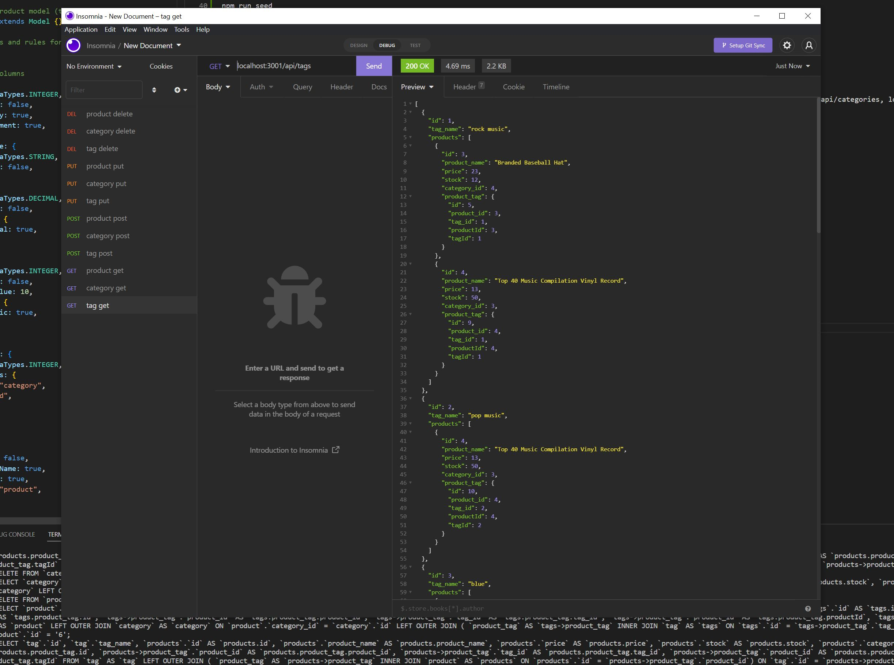
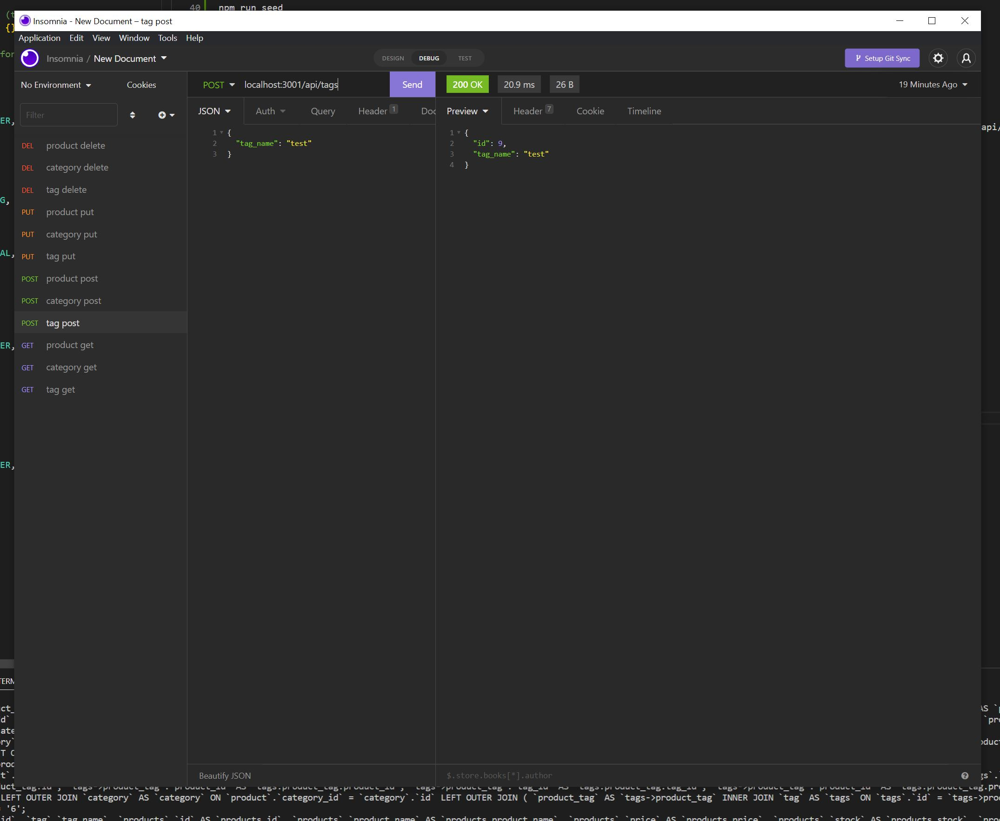
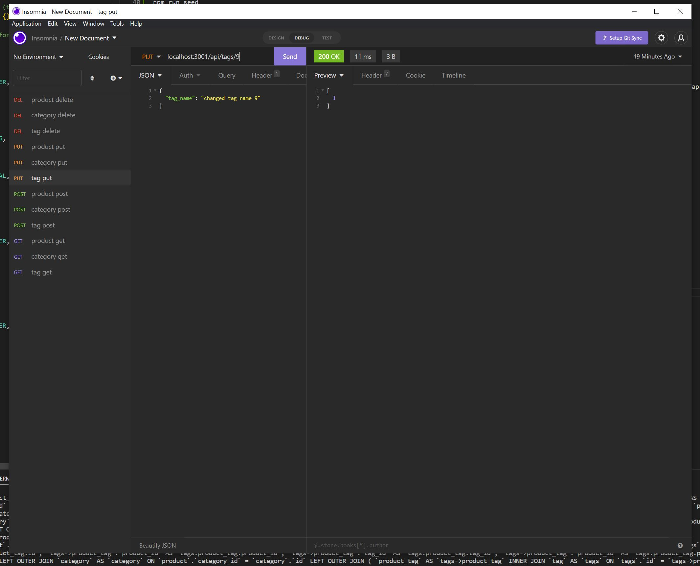
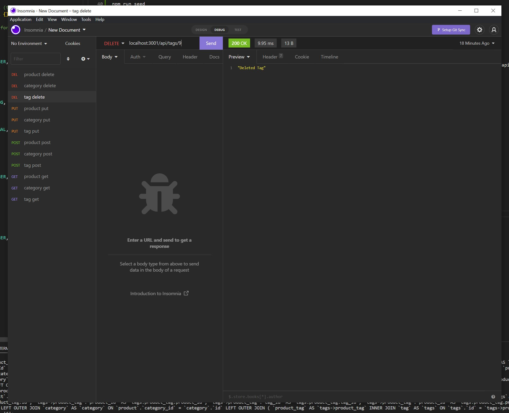

# theBestECommerceBackEnd

## Table of Contents

- [Description](#description)
- [Installation](#installation)
- [Usage](#usage)
- [Questions](#questions)
- [License](#license)
- [Walkthrough](#walkthrough)
- [Screenshots](#screenshots)

## Description

This application will shows how an E-commerce business might use their back end to add products, categories of products and tags on their products. The application uses GET, POST, PUT, and DELETE routes combined with a databse to achieve this.

## Installation

You can clone the repository from this command:

```bash
git clone https://github.com/Zzaclipse/theBestECommerceBackEnd.git
```

## Usage

First create the database by logging in to your mysql and either typing the commands found in db/schema.sql or run the following command:

```bash
source schema.sql
```

You must install all dependencies using the following command:

```bash
npm i
```

Then seed the database with some products, categories and tags with the following command:

```bash
npm run seed
```

The application will be invoked in the command line by using the following command:

```bash
npm start
```

Once the application server is started you can navigate to localhost:3001 in insomnia and use GET, POST, PUT, DELETE routes on localhost:3001/api/categories, localhost:3001/api/tags or localhost:3001/api/products

## Questions

What is the developers github?

[Zzaclipse](https://github.com/Zzaclipse)

Where can I reach the developer to ask additional questions?

za.stokes@gmail.com

## License

This application is licened under ISC License

[](https://opensource.org/licenses/ISC)

## Walkthrough

[Video](https://drive.google.com/file/d/1qG8D7gs0xZPmf-txCTC4IMUiRzdYt1lA/view)

## Screenshots





